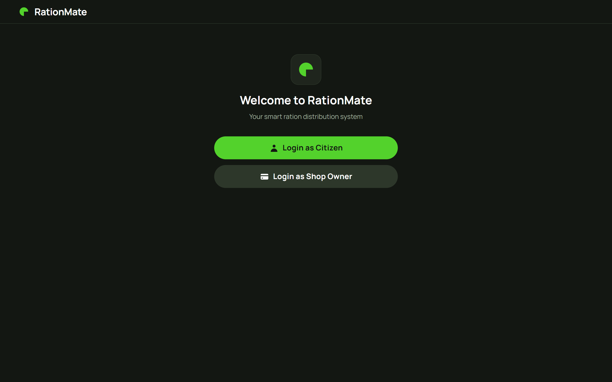

# 🛒 RationMate


> **Live Demo → [rationmate.onrender.com](https://rationmate.onrender.com)**

---

## 🧠 The Problem

In India, millions of families depend on ration shops under the Public Distribution System (PDS). But here's the harsh reality — people travel kilometres to their nearest ration shop, wait in long queues, only to find out the stock ran out days ago.

There's no way to check stock availability beforehand. No transparency. No system.

**RationMate fixes that.**

---

## 💡 What It Does

RationMate is a full-stack inventory management system built for ration shops — with two distinct user roles:

**For Shop Owners 🏪**
- Secure login with password authentication
- Real-time inventory dashboard — add, update, and delete stock
- Changes reflect instantly for citizens

**For Citizens 👨‍👩‍👧**
- OTP-based login via SMS (no password needed)
- Browse all nearby ration shops
- See live stock availability with colour-coded badges — green (available), yellow (low), red (out of stock)
- Know before you go

---

## 📸 Screenshots

### Home Screen


### Shop Owner — Inventory Dashboard


### Citizen — Shop Picker


### Citizen — Live Stock View


---

## 🛠️ Tech Stack

| Layer | Technology |
|-------|-----------|
| Backend | Node.js + Express |
| Database | MongoDB Atlas + Mongoose |
| Authentication | JWT (shop owners) + Twilio OTP SMS (citizens) |
| Security | bcrypt, Helmet, CORS, Rate Limiting |
| Frontend | Vanilla HTML + CSS + JavaScript |
| Deployment | Render |

---

## 🏗️ Architecture

```
rationmate/
├── backend/
│   ├── models/          # Mongoose schemas (Shop, OTP, User)
│   ├── routes/          # Express API routes
│   ├── middleware/       # JWT auth middleware
│   └── server.js        # Entry point
├── frontend/
│   ├── css/styles.css
│   ├── js/
│   │   ├── app.js       # SPA routing logic
│   │   └── api.js       # API call handlers
│   └── index.html
└── ss/                  # Screenshots
```

---

## 🚀 Run Locally

**1. Clone the repo**
```bash
git clone https://github.com/Mohamed-shameel/rationmate
cd rationmate/backend
```

**2. Install dependencies**
```bash
npm install
```

**3. Set up `.env`**
```bash
cp .env.example .env
# Fill in your MongoDB URI, JWT secret, and Twilio credentials
```

**4. Start the server**
```bash
npm run dev
```

**5. Open in browser**
```
http://localhost:5000
```

---

## 🔐 Default Credentials (Local Testing)

| Shop | Shop ID | Password |
|------|---------|----------|
| Main Street Ration | `SHOP001` | `admin123` |
| Central Ration Depot | `SHOP002` | `shop123` |

> Citizen login requires a real mobile number for OTP via Twilio.

---

## 🌱 What I Learned

- Designing **role-based authentication** — two completely different auth flows in one app
- Integrating **Twilio SMS API** for real OTP delivery
- Managing **environment-based configuration** (dev vs production)
- Deploying a full-stack Node.js app on **Render** with cloud MongoDB

---

## 🔮 Future Scope

- Push notifications when stock is refilled
- Monthly distribution analytics for shop owners
- Aadhaar-based citizen verification
- Multi-language support (Tamil, Hindi)

---

## 👨‍💻 Built By

**Mohamed Shameel** — 2nd Year BE CSE (AIML) @ Chennai Institute of Technology  
Pursuing BS Data Science @ IIT Madras

[GitHub](https://github.com/Mohamed-shameel) • [LinkedIn](https://www.linkedin.com/in/mohamedshameel2006/)